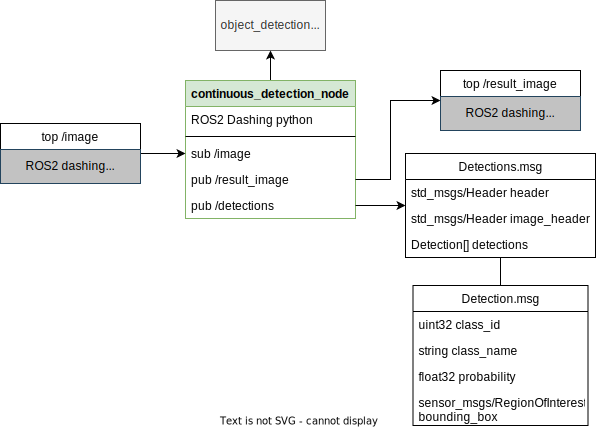
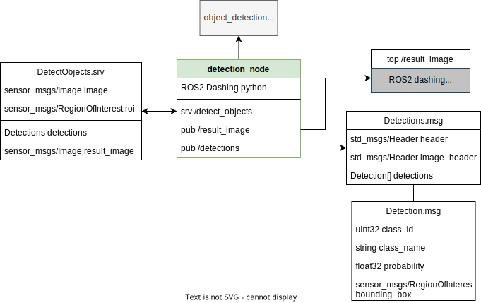

# Object Detector Tensorflow

ROS2 Nodes for TensorFlow Object Detection Inference

## How to start:
1. Place the tensorflow saved_model folder into the `./ros/object_detector_tensorflow/data/` path
2. Write the correct names of possible classes in the file `./ros/object_detector_tensorflow/data/label_map.txt`
   ```yaml
   class1 #label id = 0
   class2 #label id = 1
   ```
3. Set the correct ROS_DOMAIN_ID in `./.env`
    ```yaml
    ROS_DOMAIN_ID=66
    ```
4. (only once) Build the docker container
   ```bash
   . build_docker.sh
   ```
5. Start the docker container
   ```bash
   . start_docker.sh
   ```
6. Launch the ros node
   ```bash
   ros2 launch object_detector_tensorflow detection.launch.py
   ```

## How to test:
1. Place a color(rgb) image in this folder: `./ros/object_detector_tensorflow/data/test_rgb.png`
2. Place a depth image in this folder: `./ros/object_detector_tensorflow/data/test_depth.png`
3. Launch detection_node
    ```bash
    ros2 launch object_detector_tensorflow detection.launch.py
    ```
4. Run client node
    ```bash
    ros2 run object_detector_tensorflow client
    ```
5. Run dummy image publisher
    ```bash 
    ros2 run object_detector_tensorflow dummy_publisher
    ```
The client should make a service call to the detection node and request inference. The detection node should wait for depth and color images to be published to the topics defined in the `params.yaml` file under the `config` folder. It is important to note, that the topics defined in the `params.yaml` file need to be mirrored in the `DummyPublisher.py` file under the `object_detector_tensorflow` folder.

```python
class ImagePublisher(Node):
	def __init__(self):
		super().__init__('image_publisher')
		self.rgb_publisher = self.create_publisher(Image, '<rgb_image_topic>', 10)
		self.depth_publisher = self.create_publisher(Image, '<depth_image_topic>', 10)
		self.timer = self.create_timer(1, self.timer_callback)
		self.bridge = CvBridge()
```

## Interface:

### Continuous detection node

- `continuous_detection_node` (ROS2 Humble python)

    Node used for continuous stream of image data



#### Topics

- subscribe `image` (sensor_msgs/Image)
- publish `continuous_detection_node/result_image` (sensor_msgs/Image)
- publish `continuous_detection_node/detections` (custom type)

    ```bash
    # Detections.msg
    std_msgs/Header header
    std_msgs/Header image_header
    Detection[] detections
    ```
    
    ```bash
    # Detection.msg
    uint32 class_id
    uint32 instance_id
    string class_name
    float32 probability
    geometry_msgs/Point center
    sensor_msgs/RegionOfInterest bounding_box
    sensor_msgs/Image mask
    geometry_msgs/Quaternion orientation
    ```

#### Parameters

Change in `ros/object_detector_tensorflow/config/params.yaml`

```bash
saved_model_path: "data/saved_model"  # Path to TensorFlow saved model folder
label_map_path: "data/label_map.txt"  # Text file with class names (one label per line)
image_topic: "/image"  # ROS topic to listen for images
depth_image_topic: "/stereo/depth"            # ROS topic to listen for depth images
detect_hz: 0.1      # Detect and publish rate in Hz
min_probability: 0.5            # Minimum probability for detections to be reported
max_gpu_memory_fraction: 1.0    # Limits the GPU memory usage of the TensorFlow model to only a fraction (between 0 and 1)
result_image_size: [640,480]    # Dimensions of the result image [x,y]
```

---

### Detection Node

- `detection_node` (ROS2 Humble python)

    Node to request detection on the latest image. Returns Inference on all detected objects packaged along with the corresponding depth image. Latest detections and result image with detection annotations is also published at regular intervals.



#### Topics

- publish `detection_node/result_image` (sensor_msgs/Image)
- publish `detection_node/detections` (custom type)

#### Services

- server `detection_node/detect_objects` (custom type)

    ```bash
    # DetectObjects.srv
    sensor_msgs/RegionOfInterest roi
    ---
    Detections detections
    sensor_msgs/Image result_image
    sensor_msgs/Image reference_image
    ```
- Area within which inference is performed has to be provided in the request under roi. This can be used to restrict the detection area to reduce misclassifications.
- Reference image attribute contains the corresponding depth image to the detections.
#### Parameters

Change in `ros/object_detector_tensorflow/config/params.yaml`

```bash
saved_model_path: "data/saved_model"  # Path to TensorFlow saved model folder
label_map_path: "data/label_map.txt"  # Text file with class names (one label per line)
image_topic: "/image"            # ROS topic to listen for images
depth_image_topic: "/stereo/depth"            # ROS topic to listen for depth images
min_probability: 0.95            # Minimum probability for detections to be reported
max_gpu_memory_fraction: 1.0    # Limits the GPU memory usage of the TensorFlow model to only a fraction (between 0 and 1)
result_image_size: [640, 480]
```

## Dependencies

- tensorflow
- opencv

## How to install

    pip3 install tensorflow
    sudo apt install opencv
    pip3 install numpy
    sudo apt install ros-humble-diagnostic-updater
    sudo apt install ros-humble-ros1-bridge


## How to launch:

    ros2 launch object_detector_tensorflow detection.launch.py
    ros2 launch object_detector_tensorflow continuous_detection.launch.py

## Debugging

### generate a test image

    from cv_bridge import CvBridge, CvBridgeError
    import numpy as np
    bridge = CvBridge()
    np.zeros([960, 1280, 3], dtype=np.uint8)
    image = bridge.cv2_to_imgmsg(
    np.zeros([960, 1280, 3], dtype=np.uint8), encoding="bgr8")

### display test image from ROS-msgs

    image = bridge.imgmsg_to_cv2(image)
    cv2.imshow(image)
    cv2.waitKey(0)

### load image file

    # Test image from folder
    from cv_bridge import CvBridge
    import numpy as np
    import cv2

    bridge = CvBridge()

    img = cv2.imread('../data/test_image_0.png', 0) 
    image = bridge.cv2_to_imgmsg(img, encoding="bgr8")
